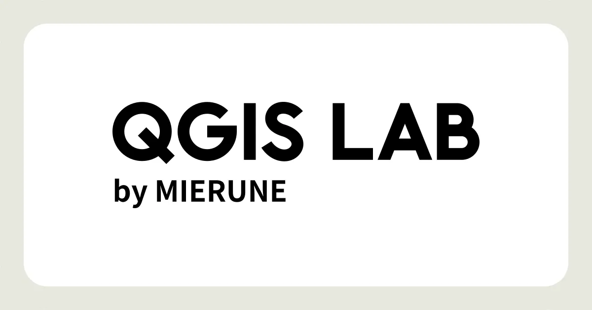

[QGIS LAB](https://qgis.mierune.co.jp/)の記事を、QGIS内で検索・閲覧・ブックマークできるプラグインです。

Processingツールボックスの「QGIS LAB → 記事を検索」から、キーワードに一致する記事を新しい順に取得できます。キーワードが空の場合は最新記事を取得します。取得上限は既定で100件です。インターネット接続が必要です。

結果は、`title`・`url`・`summary`・`published`・`categories`列を持つジオメトリなしのテーブルです。一時レイヤやGeoPackageなどに保存でき、モデルからも利用できます。キャンセルすると、その時点までに取得した結果が残ります。

QGISのPythonコンソールからも実行できます。

```python
import processing

result = processing.run("qgislab:searcharticles", {
    "QUERY": "座標系",
    "MAX_RESULTS": 100,
    "OUTPUT": "TEMPORARY_OUTPUT",
})
QgsProject.instance().addMapLayer(result["OUTPUT"])
```
